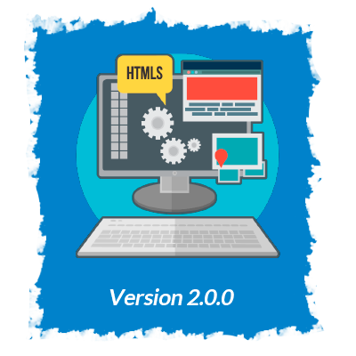

 
 

The version on top of this file this the last.

 
</img>

- Almost all info show in the main page, just there is a secondary view for `more projects`.
- Each project shows his version and have a link for the `md` file in github
- Skill icons are more bigger now
- Responsive Nav is working
- Added favicon

</img>

- JSON File of project is duplicated until i learn how show different amount of project depending of place.
- Responsive nav still need some tweaks.
- Scroll nav show and hide instead of show and wait for a move of mouse.